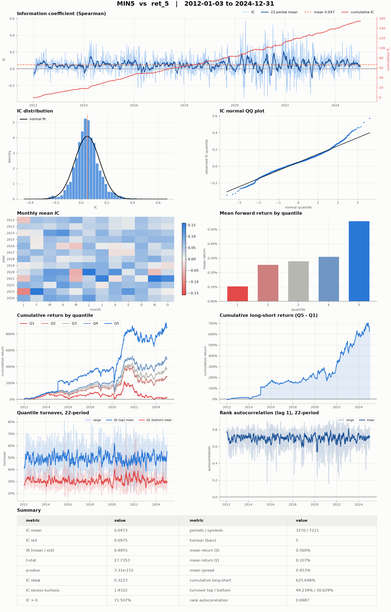
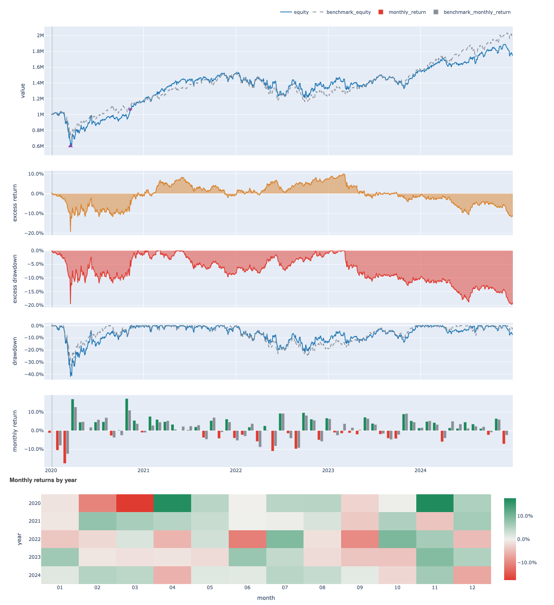

<p align="center">
  <picture>
    <source media="(prefers-color-scheme: dark)" srcset="docs/assets/logo-dark.svg">
    
  </picture>
</p>

<p align="center">
  <a href="https://www.python.org/downloads/"></a>
  <a href="LICENSE"></a>
  <a href="https://github.com/Menooker/KunQuant"></a>
  <a href="https://vectorbt.dev/"></a>
</p>

<p align="center">English | <a href="README.zh-CN.md">简体中文</a></p>

quantlab is a Python backend for quantitative equity research. It takes you from raw market
data to a backtested trading strategy in five stages: download prices, turn them into a
clean panel, compute factors and labels, train a model that predicts future returns, and
backtest the portfolio those predictions imply. Every stage is driven by a small
configuration object, so any run can be saved, rebuilt and repeated exactly.

- **Documentation:** [docs/README.md](docs/README.md)
- **Examples:** [examples/](examples/README.md)
- **Source code:** https://github.com/ZhaorongDai/quantlab
- **Bug reports:** https://github.com/ZhaorongDai/quantlab/issues
- **Contributing:** [CONTRIBUTING.md](CONTRIBUTING.md)

```text
 data source  ->  dataset  ->  factors and labels  ->  model  ->  backtest
 Tiingo,          raw files     KunQuant or             XGBoost,    target weights,
 Alpaca,          to a panel    Polars                  PyTorch,    vectorbt,
 WRDS                                                   pytabkit    HTML report
```

## What it offers

All stages exchange data in one format: an `xarray.Dataset` whose variables are laid out on
the two dimensions `timestamp` and `symbol`. We call such a dataset a *panel*. Panels are
stored on disk as Zarr, and models train on them directly, so there is no conversion to and
from DataFrames between stages.

Data comes from Tiingo, Alpaca and WRDS (CRSP daily stock files and TAQ quotes). Downloads
can be interrupted and resumed. To avoid *survivorship bias*, the error of testing only on companies that
still exist today, quantlab can build universes from historical index membership and from
full-market listings that include delisted stocks.

Factors are computed with [KunQuant](https://github.com/Menooker/KunQuant), which compiles
factor formulas to native code and can run both on a history and bar by bar, or with Polars
for quick batch experiments. Tree models and neural networks share one interface, with
walk-forward cross-validation built in. The backtester, built on
[vectorbt](https://vectorbt.dev/), reports in-sample and out-of-sample results separately and
writes a run directory that can be rebuilt and re-run later.

quantlab is a research backend. It has no web front end and does not send orders to a broker.

## Installation

quantlab needs Python 3.13 or newer, [uv](https://docs.astral.sh/uv/) and a C++ compiler
(KunQuant compiles factor code at run time).

```bash
git clone https://github.com/ZhaorongDai/quantlab.git
cd quantlab
uv sync
```

Neural-network models use a CUDA GPU when one is available and the CPU otherwise. See the
[installation guide](docs/getting-started/installation.md) for GPU and macOS notes.

## Quick start

The fastest way to see the whole pipeline is the end-to-end example. It builds a synthetic
price panel, computes factors, trains an XGBoost model, backtests it and rebuilds the run from
its saved configuration. It needs no network access and no credentials, and runs in about
half a minute on a laptop.

```bash
uv run python examples/quickstart.py
```

The snippet below shows the two ideas everything else builds on: the registry of data sources
and the panel format.

```python
import tempfile
from pathlib import Path

import numpy as np
import pandas as pd
import xarray as xr

from quantlab.base.config import DatasetConfig
from quantlab.dataset.stock import StockDataset
from quantlab.registry import DataSourceRegistry, credential_status

# Which vendors can quantlab download from, and are their credentials set?
for source in DataSourceRegistry.all():
    print(source.vendor, credential_status(source))

# Write a tiny panel: 5 business days x 3 symbols of adjusted close prices.
root = Path(tempfile.mkdtemp())
timestamps = pd.date_range("2024-01-01", periods=5, freq="B")
symbols = ["AAPL", "MSFT", "NVDA"]
close = 100 + np.random.default_rng(0).normal(size=(5, 3)).cumsum(axis=0)
xr.Dataset(
    {"adjClose": (("timestamp", "symbol"), close)},
    coords={"timestamp": timestamps, "symbol": symbols},
).to_zarr(root / "prices.zarr", mode="w")

# Read it back through a dataset object, the entry point of the pipeline.
dataset = StockDataset(
    DatasetConfig(
        zarr_file_path=str(root / "prices.zarr"),
        raw_data_dir_path=str(root / "raw"),
        market="us_equity",
        frequency="1d",
        start_date="2024-01-01",
        end_date="2024-01-31",
    )
)
print(dataset.read().get_xarray_dataset())
```

```text
alpaca {'APCA_API_KEY_ID': False, 'APCA_API_SECRET_KEY': False}
tiingo {'TIINGO_API_KEY': False}
wrds {'WRDS_USERNAME': False}
<xarray.Dataset> Size: 208B
Dimensions:    (timestamp: 5, symbol: 3)
Coordinates:
  * timestamp  (timestamp) datetime64[ns] 40B 2024-01-01 ... 2024-01-05
  * symbol     (symbol) <U4 48B 'AAPL' 'MSFT' 'NVDA'
Data variables:
    adjClose   (timestamp, symbol) float64 120B ...
```

`False` means that source's credentials are not set in your environment. The
[quickstart guide](docs/getting-started/quickstart.md) walks through the full example step by
step.

## What the output looks like

The two figures below come from the examples in
[examples/wrds_us_equity/](examples/wrds_us_equity/README.md), run on CRSP daily bars from
WRDS: the factor report on the full US market, the backtest on the point-in-time S&P 500.

### Factor report

`Factor.analyze()` pairs every factor with every forward-return label and writes one
alphalens-style figure per pair: the information coefficient (IC) over time, its distribution,
monthly mean IC, returns by quantile, the long-short curve, turnover and rank autocorrelation,
plus a summary table and tidy CSVs. This is `MIN5` from the Alpha158 set, the 5-day low
relative to the close, against the 5-day open-to-open forward return on every common stock
in CRSP, about 7,200 symbols including the delisted ones, 2012 to 2024, from
`market_factor_analysis.py`.

<p align="center">
  
</p>

### Backtest report

Every backtest writes a run directory with the target weights, the equity curve, a metrics
file and an HTML report. The report shows the equity curve against the benchmark, the excess
return and excess drawdown, the drawdown, monthly returns and a monthly-return heatmap, followed
by the metrics split into in-sample and out-of-sample columns. This is `sp500_xgb_td.py`: a
long-only top-50 portfolio rebalanced every 5 bars from an XGBoost model trained on 2012 to
2019, backtested out of sample on 2020 to 2024 against buy-and-hold SPY. Over this window the
strategy trails SPY; the figure is here to show the report, not a result to copy.

<p align="center">
  
</p>

## Credentials

quantlab reads credentials only from environment variables. They are never accepted on the
command line and never written to a configuration file or a log.

| Variable | Used for |
|----------|----------|
| `TIINGO_API_KEY` | Tiingo end-of-day US stock prices |
| `APCA_API_KEY_ID`, `APCA_API_SECRET_KEY` | Alpaca bars, quotes and trades |
| `WRDS_USERNAME` | WRDS (CRSP and TAQ); the password is read from `~/.pgpass` |
| `WANDB_API_KEY` | Optional Weights & Biases logging during training |
| `QUANTLAB_DATA_DIR` | Optional root directory the library's config factories derive data paths from; the WRDS scripts take `--download-dir` and `--zarr-dir` instead |

The download scripts live in `scripts/wrds/` (`index.py`, `market.py`, `etf.py`, `nbbo.py`)
and each prints its options with `--help`, for example
`uv run python scripts/wrds/index.py --help`. Tiingo, Alpaca and Binance have library
interfaces only. The [data sources guide](docs/user-guide/data-sources.md) explains where files
are written and how to resume an interrupted download.

## Documentation

The [documentation](docs/README.md) is organised in three parts. *Getting started* covers
installation and the quick start. The *user guide* has one page per pipeline stage: data
sources, WRDS, datasets, universes, factors, models and backtesting. The *developer guide*
shows how to add your own data source, dataset, storage backend, factor, model or backtest
rule, and explains the machinery that makes long jobs safe to interrupt.

Every public class and function also has a docstring in the
[numpydoc](https://numpydoc.readthedocs.io/en/latest/format.html) format, readable with
`help()` in Python.

## Testing

The test suite runs offline and needs no credentials:

```bash
uv run pytest
```

The KunQuant factor tests compile C++ and take a few minutes.
`tests/test_crsp_rebuild_measurements.py` measures a real CRSP store and fails with an
explanatory message unless `QUANTLAB_DATA_ROOT` points at one; a plain `uv run pytest`
never collects it, and it runs only when named on the command line.

## Project status

quantlab is under active development, and its interfaces may still change. Event-driven
backtesting with NautilusTrader, a service layer and a web front end are planned but not
implemented.

## Contributing

Bug reports, questions and pull requests are welcome. Please read
[CONTRIBUTING.md](CONTRIBUTING.md) before opening a pull request.

## License

quantlab is released under the [MIT License](LICENSE).
