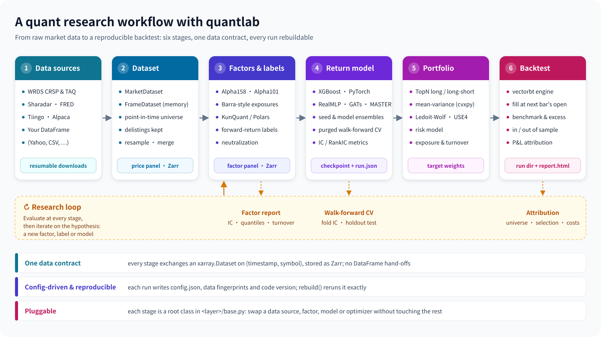
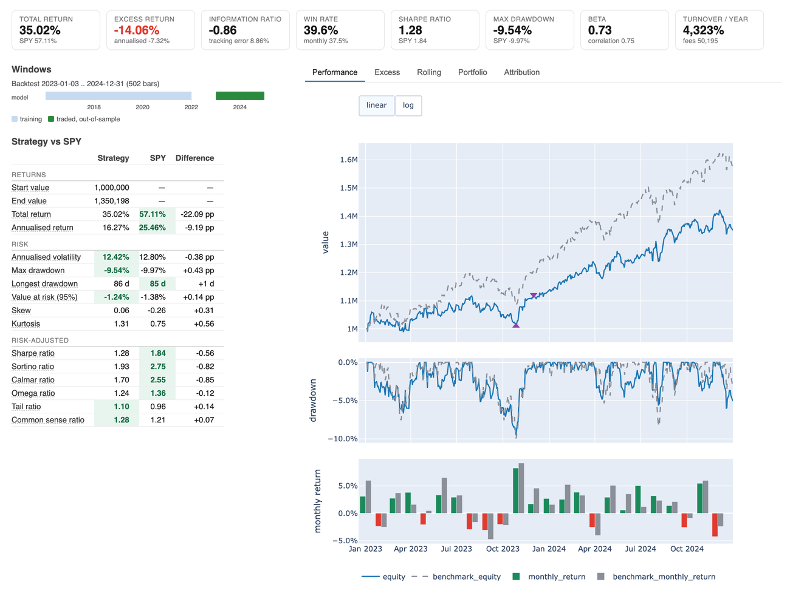
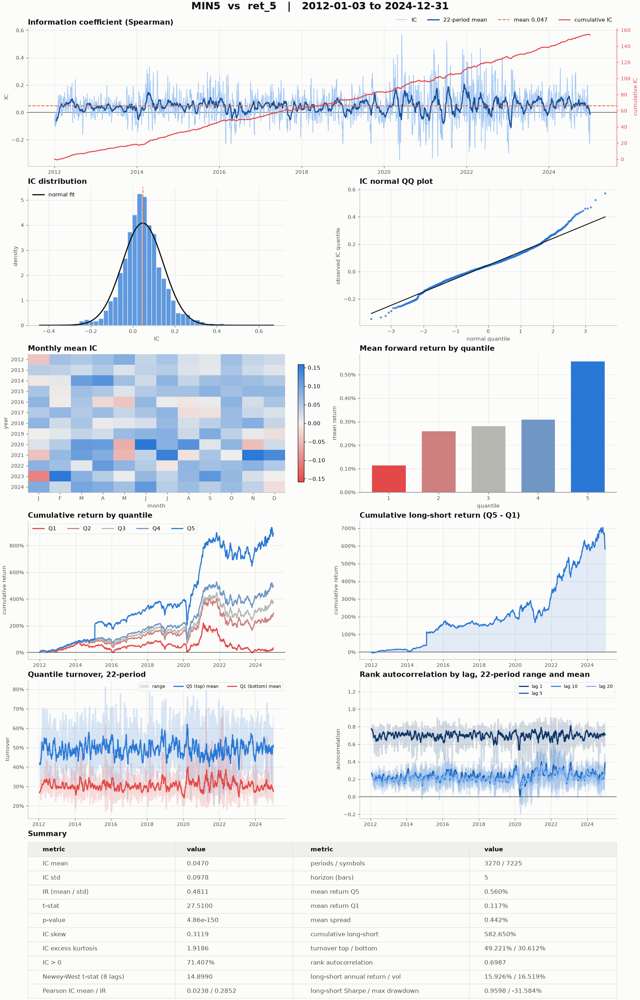
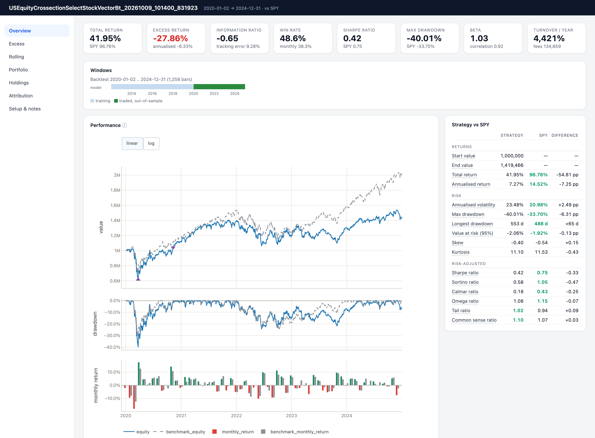

<p align="center">
  <picture>
    <source media="(prefers-color-scheme: dark)" srcset="docs/assets/logo-dark.svg">
    
  </picture>
</p>

<p align="center">
  <a href="https://www.python.org/downloads/"></a>
  <a href="LICENSE"></a>
  <a href="https://github.com/Menooker/KunQuant"></a>
  <a href="https://vectorbt.dev/"></a>
</p>

<p align="center">English | <a href="README.zh-CN.md">简体中文</a></p>

quantlab is a Python backend for quantitative equity research. It takes you from raw market
data to a backtested portfolio in one pipeline: load prices into a clean panel, compute
factors and labels, train a model that predicts future returns, turn the predictions into
target weights, and backtest them. Every stage is driven by a small configuration object, so
any run can be saved, rebuilt and repeated exactly.

- **Documentation:** [docs/README.md](docs/README.md)
- **Using your own DataFrames:** [docs/api.md](docs/api.md)
- **Examples:** [examples/](examples/README.md)
- **Source code:** https://github.com/ZhaorongDai/quantlab
- **Bug reports:** https://github.com/ZhaorongDai/quantlab/issues
- **Contributing:** [CONTRIBUTING.md](CONTRIBUTING.md)

## The research workflow

<p align="center">
  
</p>

A study in quantlab runs through six stages. Each stage is a root class in its own layer
(`quantlab/<layer>/base.py`), takes the previous stage's output and hands on its own:

| Stage | What it does | Main classes | Output |
|-------|--------------|--------------|--------|
| 1. Data sources | Resumable downloads from WRDS (CRSP, TAQ), Sharadar, FRED, Tiingo and Alpaca, or your own DataFrame | `DataSourceRegistry`, `scripts/wrds/`, `scripts/sharadar/` | Raw files |
| 2. Dataset | Turns raw bars into a panel; point-in-time universes, delisted stocks kept, resampling and merging | `MarketDataset`, `CrspStockDataset`, `FrameDataset` | Price panel |
| 3. Factors and labels | Compiled factor graphs (Alpha158, Alpha101, Barra-style exposures, neutralization) and forward-return labels | `Alpha158Stock`, `BarraStyle`, `Return` | Factor panel |
| 4. Return model | Tree models and neural networks behind one interface, seed and model ensembles, purged walk-forward CV | `XGBoostRegressor`, `RealMLPRegressor`, `GATsRegressor`, `SeedEnsemble` | Checkpoint, `run.json` |
| 5. Portfolio | Predictions to target weights: TopN, or mean-variance with a Ledoit-Wolf or USE4 factor risk model | `TopNConstructor`, `MeanVarianceOptimizer` | Target weights |
| 6. Backtest | vectorbt simulation with next-bar fills, fees, delisting settlement and a benchmark | `USEquityCrossectionSelectStockVectorBt` | Run directory, `report.html` |

Research is rarely a straight line, so evaluation is built into three of the stages:
`Factor.analyze()` writes an IC and quantile report for every factor, `train_cv` scores
each walk-forward fold and a holdout, and every backtest splits its return into universe,
selection and cost parts. What you learn there goes back into stage 3 as the next factor,
label or model.

## Why quantlab

- **One data contract.** Every stage exchanges an `xarray.Dataset` on the two dimensions
  `timestamp` and `symbol`, a *panel*, stored on disk as Zarr. Models train on panels
  directly; there is no DataFrame conversion between stages, and any stage can be swapped
  without touching the others.
- **Free of look-ahead and survivorship bias by construction.** Universes come from
  historical index membership or full-market listings that include delisted stocks; a
  signal formed at bar t fills at bar t+1's open; a delisted holding is settled at its last
  price; an order without a real fill price is rejected and the holding kept.
- **Reproducible runs.** Each training and backtest run writes its configuration, data
  fingerprints and code version next to its results. `rebuild()` turns a run directory
  back into the objects that produced it and reruns them to the same equity curve.
- **Fast factors.** [KunQuant](https://github.com/Menooker/KunQuant) compiles factor
  formulas to native code and runs them over a whole history or bar by bar, so a factor
  written for research can later run on live data. Polars is there for quick batch
  experiments.
- **Bring your own data.** A pandas or polars frame becomes a dataset through
  `FrameDataset`, and `quantlab.api` offers factors, labels, a factor report and a
  backtest as single function calls on frames.
- **Research-grade reports.** An alphalens-style factor report, model metrics (IC, RankIC,
  ICIR) per split and per fold, and an HTML backtest report with in-sample and
  out-of-sample columns and a benchmark comparison.

quantlab is a research backend. It has no web front end and does not send orders to a broker.

## Installation

quantlab needs Python 3.13 or newer, [uv](https://docs.astral.sh/uv/) and a C++ compiler
(KunQuant compiles factor code at run time).

```bash
git clone https://github.com/ZhaorongDai/quantlab.git
cd quantlab
uv sync
```

All model heads, neural-network and tree models alike, use a CUDA GPU when one is available
and the CPU otherwise. See the [installation guide](docs/getting-started/installation.md) for
GPU and macOS notes.

## A pipeline on Yahoo Finance data

[`examples/yahoo_us_equity.py`](examples/yahoo_us_equity.py) runs the whole pipeline on free
data, with no account and no credentials, in about twenty seconds on a laptop. It downloads
ten years of daily bars for the 30 Dow Jones stocks and SPY with
[yfinance](https://github.com/ranaroussi/yfinance), which is not a quantlab dependency:

```bash
uv run --with yfinance python examples/yahoo_us_equity.py
```

**1. Data.** yfinance returns a pandas frame. `FrameDataset` holds it in memory as a
panel, renaming the columns to the split- and dividend-adjusted fields the stock factors and
the US-equity backtester read. Nothing is written to a Zarr store.

```python
import yfinance as yf
from quantlab.dataset.memory import FrameDataset

wide = yf.download(DOW_30 + ["SPY"], start="2015-06-01", end="2025-01-01", auto_adjust=True)
bars = wide.stack(level="Ticker", future_stack=True).reset_index().dropna(subset=["Close"])
COLUMNS = {"Date": "timestamp", "Ticker": "symbol", "Open": "adjOpen", "High": "adjHigh",
           "Low": "adjLow", "Close": "adjClose", "Volume": "adjVolume"}
stocks, spy = bars[bars.Ticker != "SPY"], bars[bars.Ticker == "SPY"]
prices = FrameDataset(stocks, columns=COLUMNS)
```

**2. Factors, label and model.** The 169 Alpha158 factors and the 5-bar open-to-open forward
return are computed with KunQuant, and an XGBoost model is trained on 2016 to 2021 and tested
on 2022.

```python
factor = Alpha158Stock(FactorConfig(dataset=prices, warmup_bars=60, mode="batch",
                                    data_columns=ADJUSTED, file_path=".../alpha158.zarr"))
label = Return(FactorConfig(dataset=prices, warmup_bars=0, mode="batch",
                            data_columns=("adjOpen",), kwargs={"n_forward_periods": 5},
                            file_path=".../ret_5.zarr"))
model = XGBoostRegressor(ModelConfig(
    factors=[factor], labels=[label], model_save_dir=".../models",
    factor_data_strategy="cal", label_data_strategy="cal",
    hyperparameters={"num_boost_round": 200, "max_depth": 3, "eta": 0.03},
    val_size=0.2, start_date="2016-01-01", end_date="2022-12-31",
    train_start="2016-01-01", train_end="2021-12-31",
    test_start="2022-01-01", test_end="2022-12-31",
))
model.collect()
checkpoint = model.train()
```

**3. Portfolio and backtest.** On 2023 and 2024, data the model never saw, every fifth bar
the ten stocks with the highest predicted return are held in equal weights, against
buy-and-hold SPY.

```python
backtester = USEquityCrossectionSelectStockVectorBt(CrossSectionBacktestConfig(
    price_dataset=prices,
    benchmark_dataset=FrameDataset(spy, columns=COLUMNS),
    model=..., model_mode="load", checkpoint=str(checkpoint),
    start_date="2023-01-01", end_date="2024-12-31", output_dir=".../backtests",
    rebalance_periods=5,
    constructor=TopNConstructor(TopNConfig(direction="long_only", top_n=10)),
))
result = backtester.run()
```

The script prints:

```text
72,420 rows for 30 stocks, 2,414 for SPY
Price panel: {'timestamp': 2414, 'symbol': 30}
169 factors; label ['ret_5']
2022 test: IC 0.0537, RankIC 0.0365
2023-2024             top-10       SPY
Total Return [%]       35.02     57.11
Sharpe Ratio            1.28      1.84
Max Drawdown [%]        9.54      9.97
Run directory, with the HTML report: output/yahoo_us_equity/backtests/USEquityCrossectionSelectStockVectorBt_<time>
Rebuilt from its run directory, same equity curve: True
```

and writes the backtest report, shown here in part:

<p align="center">
  
</p>

The strategy trails SPY over this window; the example is here to show the pipeline, not a
strategy to trade. Its universe is today's Dow 30, so every stock in it is one that
survived, and Yahoo's prices are not point-in-time. For research, use the CRSP or Sharadar
universes below. Yahoo's adjusted prices also change in their last digits from one request
to the next, so the script keeps the first download as `output/yahoo_us_equity/bars.parquet`
and reads it on later runs.

## More examples

The offline [quick start](docs/getting-started/quickstart.md) builds a synthetic price panel
and runs the same pipeline with no network access, in about half a minute:

```bash
uv run python examples/quickstart.py
```

[examples/](examples/README.md) has one runnable script per topic (building panels, training
models, backtesting, data sources) and, for point-in-time research,
[`wrds_us_equity/`](examples/wrds_us_equity/README.md) (CRSP via WRDS) and
[`sharadar_us_equity/`](examples/sharadar_us_equity/README.md) (Sharadar). The two figures
below come from the WRDS examples.

### Factor report

`Factor.analyze()` pairs every factor with every forward-return label and writes one
alphalens-style figure per pair: the information coefficient (IC) over time, its
distribution, monthly mean IC, returns by quantile, the long-short curve, turnover and rank
autocorrelation, plus a summary table and tidy CSVs. With two or more factors it also
clusters them by their mean rank correlation. This is `MIN5` from the Alpha158 set, the
5-day low relative to the close, against the 5-day open-to-open forward return on every
common stock in CRSP, about 7,200 symbols including the delisted ones, 2012 to 2024.

<p align="center">
  
</p>

### Backtest report

This is `sp500_xgb_td.py`: a long-only top-50 portfolio on the point-in-time S&P 500,
rebalanced every 5 bars from an XGBoost model trained on 2012 to 2019, backtested out of
sample on 2020 to 2024 against buy-and-hold SPY. Over this window the strategy trails SPY;
the figure is here to show the report, not a result to copy.

<p align="center">
  
</p>

## Credentials

quantlab reads credentials only from environment variables. They are never accepted on the
command line and never written to a configuration file or a log.

| Variable | Used for |
|----------|----------|
| `WRDS_USERNAME` | WRDS (CRSP and TAQ); the password is read from `~/.pgpass` |
| `SHARADAR_API_KEY` | Sharadar US equity prices, fundamentals and index membership |
| `TIINGO_API_KEY` | Tiingo end-of-day US stock prices |
| `APCA_API_KEY_ID`, `APCA_API_SECRET_KEY` | Alpaca bars, quotes and trades |
| `WANDB_API_KEY` | Optional Weights & Biases tracking, when a config names a `WandbTracker` |
| `MLFLOW_TRACKING_USERNAME`, `MLFLOW_TRACKING_PASSWORD` or `MLFLOW_TRACKING_TOKEN` | Optional MLflow tracking on a server that asks for credentials, when a config names an `MlflowTracker` (`uv sync --extra mlflow`) |
| `QUANTLAB_DATA_DIR` | Optional root directory the library's config factories derive data paths from; the download scripts take `--download-dir` and `--zarr-dir` instead |

The download scripts live in `scripts/wrds/` and `scripts/sharadar/`, and each prints its
options with `--help`, for example `uv run python scripts/wrds/index.py --help`. Tiingo,
Alpaca and Binance have library interfaces only. The
[data sources guide](docs/user-guide/data-sources.md) explains where files are written and
how to resume an interrupted download.

## Documentation

The [documentation](docs/README.md) is organised in three parts. *Getting started* covers
installation and the quick start. The *user guide* has one page per pipeline stage: data
sources, WRDS, datasets, universes, factors, models, portfolio construction and backtesting.
The *developer guide* shows how to add your own data source, dataset, storage backend,
factor, model or backtest rule, and explains the machinery that makes long jobs safe to
interrupt.

If you already hold your data in pandas or polars DataFrames and want one capability, such
as factors, forward returns, a factor report or a backtest, without the project's stores
and configurations, start with the [frame API guide](docs/api.md) (`quantlab.api`).

Every public class and function also has a docstring in the
[numpydoc](https://numpydoc.readthedocs.io/en/latest/format.html) format, readable with
`help()` in Python.

## Testing

The test suite runs offline and needs no credentials:

```bash
uv run pytest
```

The KunQuant factor tests compile C++ and take a few minutes.
`tests/test_crsp_rebuild_measurements.py` measures a real CRSP store and fails with an
explanatory message unless `QUANTLAB_DATA_ROOT` points at one; a plain `uv run pytest`
never collects it, and it runs only when named on the command line.

## Project status

quantlab is under active development, and its interfaces may still change. Event-driven
backtesting with NautilusTrader, a service layer and a web front end are planned but not
implemented.

## Contributing

Bug reports, questions and pull requests are welcome. Please read
[CONTRIBUTING.md](CONTRIBUTING.md) before opening a pull request.

## License

quantlab is released under the [MIT License](LICENSE).
