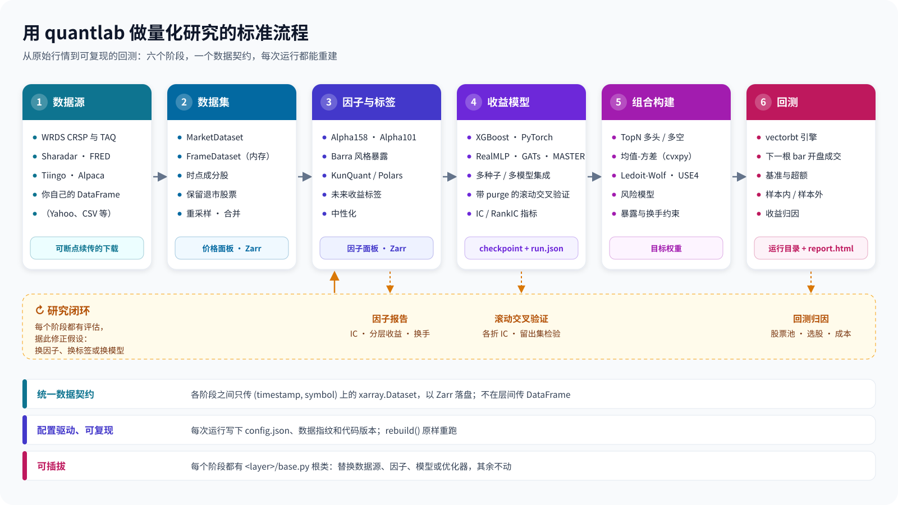

<p align="center">
  <picture>
    <source media="(prefers-color-scheme: dark)" srcset="docs/assets/logo-dark.svg">
    
  </picture>
</p>

<p align="center">
  <a href="https://www.python.org/downloads/"></a>
  <a href="LICENSE"></a>
  <a href="https://github.com/Menooker/KunQuant"></a>
  <a href="https://vectorbt.dev/"></a>
</p>

<p align="center"><a href="README.md">English</a> | 简体中文</p>

quantlab 是一个用于量化股票研究的 Python 后端。它用一条流水线把原始行情数据变成经过回测的投资组合：
把价格整理成干净的面板，计算因子和标签，训练预测未来收益的模型，把预测转换成目标权重，再对其回测。
每个阶段都由一个小的配置对象驱动，所以任何一次运行都可以保存、重建并完全复现。

- **文档：** [docs/README.md](docs/README.md)（英文），[docs/zh-CN/README.md](docs/zh-CN/README.md)（中文）
- **使用自己的 DataFrame：** [docs/zh-CN/api.md](docs/zh-CN/api.md)（中文），[docs/api.md](docs/api.md)（英文）
- **示例：** [examples/](examples/README.md)
- **源代码：** https://github.com/ZhaorongDai/quantlab
- **问题反馈：** https://github.com/ZhaorongDai/quantlab/issues
- **参与贡献：** [CONTRIBUTING.md](CONTRIBUTING.md)

## 研究流程

<p align="center">
  
</p>

在 quantlab 里做一项研究要经过六个阶段。每个阶段都是自己那一层里的一个根类（`quantlab/<layer>/base.py`），
接收上一阶段的输出，再把自己的输出交给下一阶段：

| 阶段 | 做什么 | 主要的类 | 输出 |
|------|--------|----------|------|
| 1. 数据源 | 从 WRDS（CRSP、TAQ）、Sharadar、FRED、Tiingo、Alpaca 断点续传地下载，或直接用你自己的 DataFrame | `DataSourceRegistry`、`scripts/wrds/`、`scripts/sharadar/` | 原始文件 |
| 2. 数据集 | 把原始 K 线整理成面板；时点成分股、保留退市股票、重采样与合并 | `MarketDataset`、`CrspStockDataset`、`FrameDataset` | 价格面板 |
| 3. 因子与标签 | 编译执行的因子图（Alpha158、Alpha101、Barra 风格暴露、中性化）和未来收益标签 | `Alpha158Stock`、`BarraStyle`、`Return` | 因子面板 |
| 4. 收益模型 | 树模型和神经网络共用一套接口，多种子与多模型集成，带 purge 的滚动交叉验证 | `XGBoostRegressor`、`RealMLPRegressor`、`GATsRegressor`、`SeedEnsemble` | 模型文件、`run.json` |
| 5. 组合构建 | 把预测变成目标权重：TopN，或配合 Ledoit-Wolf / USE4 因子风险模型的均值-方差优化 | `TopNConstructor`、`MeanVarianceOptimizer` | 目标权重 |
| 6. 回测 | 基于 vectorbt 的模拟：下一根 bar 成交、手续费、退市结算、基准对比 | `USEquityCrossectionSelectStockVectorBt` | 运行目录、`report.html` |

研究很少是一条直线，所以其中三个阶段内置了评估：`Factor.analyze()` 为每个因子生成 IC 与分层收益报告，
`train_cv` 给每一折滚动验证和留出集打分，每次回测都把收益拆成股票池、选股和成本三部分。
从这些评估里得到的结论回到第 3 阶段，变成下一个因子、标签或模型。

## 为什么用 quantlab

- **统一的数据契约。** 各阶段之间只交换一种数据：排列在 `timestamp`（时间）和 `symbol`（标的）两个维度上的
  `xarray.Dataset`，我们称之为*面板*，以 Zarr 格式落盘。模型直接在面板上训练，阶段之间不来回转换 DataFrame，
  替换任何一个阶段都不影响其他阶段。
- **从结构上避免前视偏差和幸存者偏差。** 股票池来自历史指数成分，或包含退市股票的全市场名单；
  在第 t 根 bar 形成的信号在第 t+1 根 bar 开盘成交；退市的持仓按最后价格结算；
  没有真实成交价的订单会被拒绝，原持仓保留。
- **可复现的运行。** 每次训练和回测都在结果旁边写下配置、数据指纹和代码版本。
  `rebuild()` 能把运行目录还原成当初的对象，重跑得到同一条净值曲线。
- **快速的因子计算。** [KunQuant](https://github.com/Menooker/KunQuant) 把因子公式编译成本地代码，
  既能对整段历史批量计算，也能逐根 bar 流式计算，研究时写的因子以后可以直接接实时数据。
  Polars 用于快速的批量实验。
- **直接用你自己的数据。** pandas 或 polars 的 DataFrame 通过 `FrameDataset` 就能成为数据集；
  `quantlab.api` 把因子、标签、因子报告和回测都做成了作用在 DataFrame 上的单个函数。
- **研究级的报告。** alphalens 风格的因子报告，按数据段和按折给出的模型指标（IC、RankIC、ICIR），
  以及区分样本内 / 样本外、带基准对比的 HTML 回测报告。

quantlab 是一个研究后端，没有网页前端，也不会向券商发送订单。

## 安装

quantlab 需要 Python 3.13 或更高版本、[uv](https://docs.astral.sh/uv/) 以及一个 C++ 编译器
（KunQuant 在运行时编译因子代码）。

```bash
git clone https://github.com/ZhaorongDai/quantlab.git
cd quantlab
uv sync
```

所有模型（神经网络和树模型）在有 CUDA GPU 时使用 GPU，否则使用 CPU。GPU 和 macOS 的注意事项见
[安装指南](docs/getting-started/installation.md)。

## 用 Yahoo Finance 数据跑一遍流水线

[`examples/yahoo_us_equity.py`](examples/yahoo_us_equity.py) 用免费数据跑完整条流水线，不需要账号和凭证，
在笔记本上大约二十秒。它用 [yfinance](https://github.com/ranaroussi/yfinance) 下载道琼斯 30 只成分股和 SPY
十年的日线数据；yfinance 不是 quantlab 的依赖：

```bash
uv run --with yfinance python examples/yahoo_us_equity.py
```

**1. 数据。** yfinance 返回一个 pandas DataFrame。`FrameDataset` 把它作为面板放在内存里，
同时把列名改成股票因子和美股回测器读取的复权字段。不写任何 Zarr 存储。

```python
import yfinance as yf
from quantlab.dataset.memory import FrameDataset

wide = yf.download(DOW_30 + ["SPY"], start="2015-06-01", end="2025-01-01", auto_adjust=True)
bars = wide.stack(level="Ticker", future_stack=True).reset_index().dropna(subset=["Close"])
COLUMNS = {"Date": "timestamp", "Ticker": "symbol", "Open": "adjOpen", "High": "adjHigh",
           "Low": "adjLow", "Close": "adjClose", "Volume": "adjVolume"}
stocks, spy = bars[bars.Ticker != "SPY"], bars[bars.Ticker == "SPY"]
prices = FrameDataset(stocks, columns=COLUMNS)
```

**2. 因子、标签和模型。** 用 KunQuant 计算 169 个 Alpha158 因子和未来 5 根 bar 的开盘到开盘收益，
在 2016 至 2021 年训练一个 XGBoost 模型，在 2022 年测试。

```python
factor = Alpha158Stock(FactorConfig(dataset=prices, warmup_bars=60, mode="batch",
                                    data_columns=ADJUSTED, file_path=".../alpha158.zarr"))
label = Return(FactorConfig(dataset=prices, warmup_bars=0, mode="batch",
                            data_columns=("adjOpen",), kwargs={"n_forward_periods": 5},
                            file_path=".../ret_5.zarr"))
model = XGBoostRegressor(ModelConfig(
    factors=[factor], labels=[label], model_save_dir=".../models",
    factor_data_strategy="cal", label_data_strategy="cal",
    hyperparameters={"num_boost_round": 200, "max_depth": 3, "eta": 0.03},
    val_size=0.2, start_date="2016-01-01", end_date="2022-12-31",
    train_start="2016-01-01", train_end="2021-12-31",
    test_start="2022-01-01", test_end="2022-12-31",
))
model.collect()
checkpoint = model.train()
```

**3. 组合构建与回测。** 在模型从未见过的 2023 和 2024 年，每 5 根 bar 调仓一次，
等权持有预测收益最高的 10 只股票，以买入持有 SPY 为基准。

```python
backtester = USEquityCrossectionSelectStockVectorBt(CrossSectionBacktestConfig(
    price_dataset=prices,
    benchmark_dataset=FrameDataset(spy, columns=COLUMNS),
    model=..., model_mode="load", checkpoint=str(checkpoint),
    start_date="2023-01-01", end_date="2024-12-31", output_dir=".../backtests",
    rebalance_periods=5,
    constructor=TopNConstructor(TopNConfig(direction="long_only", top_n=10)),
))
result = backtester.run()
```

脚本输出：

```text
72,420 rows for 30 stocks, 2,414 for SPY
Price panel: {'timestamp': 2414, 'symbol': 30}
169 factors; label ['ret_5']
2022 test: IC 0.0537, RankIC 0.0365
2023-2024             top-10       SPY
Total Return [%]       35.02     57.11
Sharpe Ratio            1.28      1.84
Max Drawdown [%]        9.54      9.97
Run directory, with the HTML report: output/yahoo_us_equity/backtests/USEquityCrossectionSelectStockVectorBt_<time>
Rebuilt from its run directory, same equity curve: True
```

并写出回测报告（下图为其中一部分）：

<p align="center">
  
</p>

在这段时间里策略跑输 SPY；这个示例用来展示流水线，不是可以拿去交易的策略。它的股票池是今天的道琼斯 30，
里面每只股票都是幸存者，而且 Yahoo 的价格不是时点数据。做研究请用下面的 CRSP 或 Sharadar 股票池。
另外，Yahoo 的复权价格每次请求在末几位都会略有不同，所以脚本把第一次下载的数据保存为
`output/yahoo_us_equity/bars.parquet`，之后的运行直接读取它。

## 更多示例

离线的[快速上手](docs/getting-started/quickstart.md)（英文）用合成价格面板跑同一条流水线，
不需要联网，大约半分钟：

```bash
uv run python examples/quickstart.py
```

[examples/](examples/README.md) 里每个主题一个可运行的脚本（构建面板、训练模型、回测、数据源）；
做时点研究请看 [`wrds_us_equity/`](examples/wrds_us_equity/README.zh-CN.md)（WRDS 上的 CRSP）和
[`sharadar_us_equity/`](examples/sharadar_us_equity/README.md)（Sharadar）。下面两张图来自 WRDS 示例。

### 因子报告

`Factor.analyze()` 把每个因子和每个未来收益标签两两配对，每一对生成一张 alphalens 风格的图：
信息系数（IC）随时间的变化、IC 的分布、月均 IC、分层收益、多空曲线、换手率和排序自相关，
另外还有一张汇总表和整齐的 CSV 文件。因子有两个或更多时，还会按平均秩相关对它们聚类。
下图是 Alpha158 中的 `MIN5`（5 日最低价相对收盘价）对 5 日开盘到开盘未来收益的报告，
股票池是 CRSP 中的全部普通股，约 7,200 个标的（含已退市股票），时间为 2012 至 2024 年。

<p align="center">
  
</p>

### 回测报告

下图来自 `sp500_xgb_td.py`：在时点 S&P 500 上做多前 50 只股票，每 5 根 bar 调仓一次，
所用 XGBoost 模型在 2012 至 2019 年训练，在 2020 至 2024 年做样本外回测，以买入持有 SPY 为基准。
这段时间里策略跑输 SPY；这张图用来展示报告的样子，不是可以照搬的结果。

<p align="center">
  
</p>

## 凭证

quantlab 只从环境变量读取凭证。凭证不会通过命令行传入，也不会写进配置文件或日志。

| 变量 | 用途 |
|------|------|
| `WRDS_USERNAME` | WRDS（CRSP 和 TAQ）；密码从 `~/.pgpass` 读取 |
| `SHARADAR_API_KEY` | Sharadar 美股价格、基本面和指数成分 |
| `TIINGO_API_KEY` | Tiingo 美股日终价格 |
| `APCA_API_KEY_ID`、`APCA_API_SECRET_KEY` | Alpaca 的 K 线、报价和成交数据 |
| `WANDB_API_KEY` | 可选，配置中指定 `WandbTracker` 时用于 Weights & Biases 实验追踪 |
| `MLFLOW_TRACKING_USERNAME`、`MLFLOW_TRACKING_PASSWORD` 或 `MLFLOW_TRACKING_TOKEN` | 可选，配置中指定 `MlflowTracker` 且服务器需要凭证时使用（`uv sync --extra mlflow`） |
| `QUANTLAB_DATA_DIR` | 可选，库内配置工厂据此推导数据路径的根目录；下载脚本改用 `--download-dir` 和 `--zarr-dir` |

下载脚本在 `scripts/wrds/` 和 `scripts/sharadar/` 中，每个脚本都可以用 `--help` 查看参数，例如
`uv run python scripts/wrds/index.py --help`。Tiingo、Alpaca 和 Binance 只有库接口。
文件写到哪里、下载中断后如何继续，见[数据源指南](docs/user-guide/data-sources.md)。

## 文档

[英文文档](docs/README.md)分为三部分：*入门*介绍安装和快速上手；*用户指南*为流水线的每个阶段各写一页，
包括数据源、WRDS、数据集、股票池、因子、模型、组合构建和回测；*开发者指南*介绍如何添加自己的数据源、数据集、
存储后端、因子、模型或回测规则，并解释让长时间任务可以安全中断的机制。部分页面有[中文版](docs/zh-CN/README.md)。

如果你的数据已经在 pandas 或 polars 的 DataFrame 里，只想用其中一项能力（因子、未来收益、因子报告或回测），
而不想使用本项目的存储和配置，请从 [Frame API 指南](docs/zh-CN/api.md)（`quantlab.api`）开始。

每个公开的类和函数都有 [numpydoc](https://numpydoc.readthedocs.io/en/latest/format.html) 格式的文档字符串，
可以在 Python 中用 `help()` 查看。

## 测试

测试套件离线运行，不需要任何凭证：

```bash
uv run pytest
```

KunQuant 因子测试需要编译 C++，耗时几分钟。`tests/test_crsp_rebuild_measurements.py` 要测量一个真实的 CRSP 存储，
除非 `QUANTLAB_DATA_ROOT` 指向这样一个存储，否则会失败并给出说明；直接运行 `uv run pytest` 不会收集它，
只有在命令行中点名时才会运行。

## 项目状态

quantlab 仍在积极开发中，接口可能还会变化。基于 NautilusTrader 的事件驱动回测、服务层和网页前端已在规划中，
但尚未实现。

## 参与贡献

欢迎提交问题报告、提问和拉取请求。提交拉取请求之前，请先阅读 [CONTRIBUTING.md](CONTRIBUTING.md)。

## 许可证

quantlab 以 [MIT 许可证](LICENSE) 发布。
