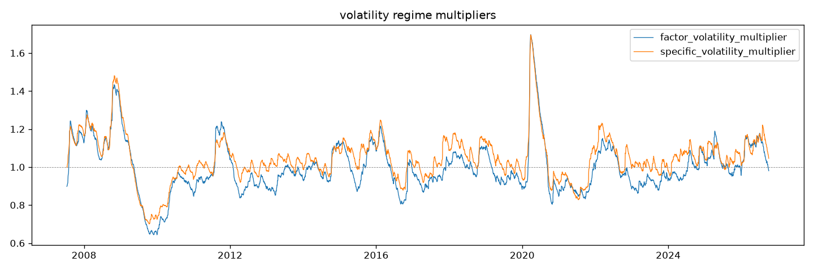
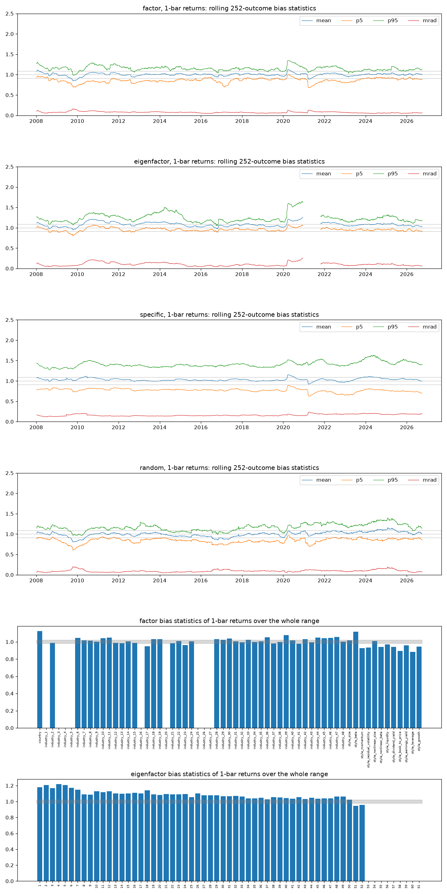
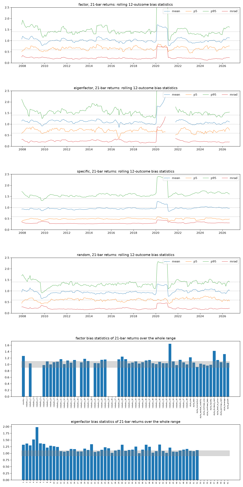
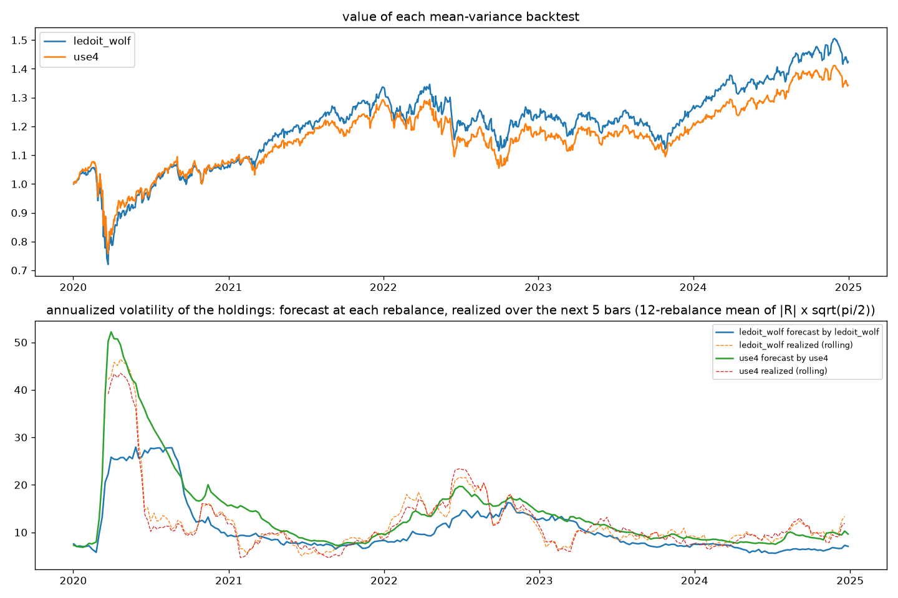

# Factor risk model (Barra USE4)

`Use4RiskModel` (`quantlab.risk.predefined.use4`) is a USE4-style factor
risk model built on the `BarraStyle` exposures (see
[Style factors](style-factors.md)). It follows Menchero, Orr and Wang, *The
Barra US Equity Model (USE4)*, Methodology Notes and Empirical Notes (MSCI,
2011). This page explains the regression and each adjustment, where the
model departs from USE4, and which defaults are MSCI's published values and
which are quantlab's own choices. It ends with the model's numbers on the
Sharadar history and a mean-variance backtest that compares it with
Ledoit-Wolf. Section and equation numbers cite the Methodology Notes as [M]
and the Empirical Notes as [E].

## Vocabulary

- A **factor return** is the return of one factor on one bar: the
  coefficient of that factor in the bar's cross-sectional regression of
  stock returns on exposures.
- A **specific return** is the part of a stock's return the factors do not
  explain: its return less its exposures times the factor returns.
- The **factor covariance** `F` is the forecast covariance of the next
  bar's factor returns.
- The **specific risk** `s` of a stock is the forecast volatility of its
  next specific return.
- A stock's forecast covariance is then `X F X' + diag(s^2)`, with `X` the
  stocks' exposures.
- A **bias statistic** is the standard deviation of returns divided by
  their forecast volatilities. A calibrated forecast gives 1 (see
  [Bias statistics](#bias-statistics)).

## A per-bar data product

The model is estimated ahead of any backtest, not re-estimated inside it.
It writes two stores, one row per bar:

| Store | Variables | Built from |
|---|---|---|
| regression | `factor_return` (timestamp, factor), `specific_return` (timestamp, symbol), `r_squared`, `estu_count`, `industry_members`, `industry_excluded` | the exposures and the prices |
| estimate | `factor_covariance` (timestamp, factor_i, factor_j), `specific_risk` (timestamp, symbol), `factor_volatility_multiplier`, `specific_volatility_multiplier` | the regression store |

Each store follows the factor lifecycle: `compute(start, end)` returns
rows, `build(start, end)` writes them, `extend(end)` appends the bars after
the recorded range and `read(start, end)` returns a range of the store. A
read outside the range recorded beside the store raises `ValueError`. Every
row depends only on a bounded window of bars ending at that bar, so a store
built in one go and one built and then extended are identical, row for row.
Changing an estimate parameter therefore rebuilds only the estimate store.

```python
from quantlab.risk.config import Use4RiskConfig
from quantlab.risk.predefined.use4 import Use4RiskModel

model = Use4RiskModel(Use4RiskConfig(
    exposures=barra_style,              # a BarraStyle whose store is built
    dataset=prices,                     # adjClose, marketcap and DTB3
    exposure_data_strategy="read",
    risk_free_symbol="DTB3",
    regression_path="risk/regression.zarr",
    estimate_path="risk/estimate.zarr",
))
model.regression.build("2001-01-03", "2026-10-02")
model.estimate.build("2007-07-13", "2026-10-02")   # after the 1637-bar warm-up
```

`quantlab.risk.base.FactorRiskModel` is the contract every factor risk
model meets: the variables of both stores, `factor_names`,
`exposure_names`, `exposure_matrix` and the two warm-ups. It also has
`factor_groups()`, which gives each factor's group (`country`, `industry`
or `style`) for a backtest's factor attribution, and `factor_labels()`,
each factor's display name in the backtest report. By default every factor
is a `style` labelled by its name. `Use4RiskModel` overrides both from its
config: its industries are named by their Fama-French 48 names and its
styles without the `style_` prefix. The USE4 method
lives entirely in `Use4RiskModel`.

A portfolio rule reads the estimate store through
`FactorRiskStoreEstimator` (see [Portfolio construction](../portfolio.md#factor-form-reading-a-factor-risk-model)).

## The regression

On every bar `t`, the excess returns of `t` are regressed on the exposures
of `t-1` ([M] §3):

- **Excess return**: adjusted close of `t` over adjusted close of `t-1`,
  less one, less the risk-free rate of `t-1`. The rate is FRED's DTB3, the
  same series `BarraStyle` reads.
- **Factors**: a country factor (1 for every stock), one factor per
  Fama-French 48 industry (1 on the stock's industry, 0 elsewhere) and the
  12 style exposures, 61 factors in all.
- **Fit**: weighted least squares over the estimation universe of `t-1`,
  weighted by the square root of the market cap of `t-1`, subject to the
  cap-weighted industry factor returns summing to 0 ([M] eq. 3.3). The
  constraint removes the collinearity of the country factor with the
  industries and makes the country factor the cap-weighted market.
- **Diagnostics**: `r_squared` is the weighted R-squared `1 - sum(w e^2) /
  sum(w y^2)`, uncentred because the country factor plays the intercept
  (our choice). `estu_count` is the stocks in the fit, and
  `industry_members` and `industry_excluded` describe each industry.
- **Thin industries**: an industry with fewer than `min_industry_members`
  (5) estimation-universe members on a bar is left out of that bar. It has
  no factor return that bar, and its members are not in the fit.
- **Outliers**: a fitted return more than `return_outlier_sigma` (5) robust
  standard deviations from the cross-sectional median is trimmed to that
  bound for the fit only. The robust standard deviation is 1.4826 times the
  median absolute deviation, so a vendor price error cannot move a factor
  return however large it is.
- **Specific returns**: for every stock with all exposures and a return,
  inside the estimation universe or not, the untrimmed excess return less
  the fitted factor part. A genuine jump therefore still shows up in
  specific risk.

## The factor covariance

The factor covariance is built in four steps ([M] §4, Appendix B). Each
reads only the last factor returns up to its window.

1. **Exponentially weighted volatilities and correlations** ([M] §4.1).
   The volatilities come from the last 252 factor returns weighted with a
   half-life of 84 bars, the correlations from the last 1512 with a
   half-life of 504 (USE4S). A missing factor return (an industry left
   out of a bar) leaves only that bar out: each correlation uses the bars
   both factors have.
2. **Newey-West**. A variance is multiplied by `C_NW = 1 + 2 sum_l b_l
   rho_l` over 5 lags ([M] eq. 5.2), with Bartlett weights `b_l = 1 - l /
   (L + 1)` and autocorrelations `rho_l` weighted with a half-life of 504
   over 1512 bars. A correlation is that of the covariance with 2 lags
   added, `G_0 + sum_l b_l (G_l + G_l')`. The forecast stays a one-bar
   forecast: Newey-West turns the variance of a sum of serially correlated
   one-bar returns into a per-bar variance that scales linearly with the
   horizon.
3. **Eigenfactor risk adjustment** ([M] §4.2, Appendix B). The covariance
   is decomposed into eigenfactors. 1000 factor-return histories are
   simulated from it, each is estimated with the same windows, half-lives
   and lags, and the volatility bias of each simulated eigenfactor is
   measured. Each eigenvariance is then multiplied by the square of its
   bias, the simulated adjustment of [M] eq. B7. Setting `eigen_scale`
   uses the scaled adjustment of eq. B8 instead. The draws of a bar are
   seeded from `eigen_seed` and the bar's timestamp, so a row does not
   depend on how the store is split between `build` and `extend`.
4. **Volatility regime adjustment** ([M] §4.3). On each bar, the
   cross-sectional bias statistic of the factor returns against the
   forecasts of the bar before is measured. The whole matrix is multiplied
   by `lambda_F^2`, the exponentially weighted mean square of those bias
   statistics over the last 126 bars with a half-life of 42. The
   correlations do not move. `lambda_F` is stored as
   `factor_volatility_multiplier`.

## The specific risk

Each stock's specific risk is built in four steps ([M] §5):

1. **Time series** ([M] §5.1): the exponentially weighted volatility of
   its last 252 specific returns, half-life 84, with no Newey-West
   adjustment by default (see [Defaults](#defaults)).
2. **Structural model** ([M] eqs. 5.3-5.5). On each bar the log
   time-series volatility of every stock with a time series is regressed on
   its exposures and its history length, `log(1 + h / 252)` with `h` its
   specific returns in the last 756 bars. A stock's structural volatility
   is `E_0` times the exponential of its fitted value, `E_0` the smearing
   estimate: the mean of `exp(residual)` over the fitted stocks. With the default
   `structural_model="fill"`, a stock without a time-series value (fewer
   than 21 returns in the window, a new listing for example) gets its
   structural value, and every other stock keeps its time series.
   `"blend"` is USE4's `gamma * time series + (1 - gamma) * structural`.
3. **Bayesian shrinkage** ([M] §5.2, eqs. 5.6-5.9) toward the cap-weighted
   mean of the stock's size decile, with intensity `q |s - m| / (d + q |s -
   m|)`, `q = 0.1`. On the Sharadar history a larger `q` flattened the
   21-bar bias statistics across forecast-volatility deciles but worsened
   the one-bar ones and the random active portfolios', so USE4's value
   stands (#203).
4. **Volatility regime adjustment** ([M] §5.3): times `lambda_S`, the same
   construction as `lambda_F` over the cap-weighted cross-sectional bias
   statistics of the estimation universe's specific returns. It is stored
   as `specific_volatility_multiplier`.

Every stock with exposures at the bar has a specific risk once enough
stocks are fitted.

## Deviations from USE4

The data quantlab has, and what MSCI does not publish, force some
departures:

- **Factors.** The industries are the point-in-time Fama-French 48 from
  SIC, not GICS, and a stock has one industry rather than several weights.
  The styles have the deviations of [Style factors](style-factors.md#deviations-from-use4)
  (no analyst forecasts).
- **Estimation universe.** The 3000 largest stocks by market cap, not the
  MSCI USA IMI.
- **Missing factor returns.** Correlations use the pairwise-available
  bars, where USE4 uses the EM algorithm. A pairwise estimate need not be
  positive semi-definite; the eigenfactor adjustment sets negative
  eigenvalues to 0.
- **Windows.** USE4 publishes half-lives but not window lengths. Every
  window here is three half-lives, so a row reads a bounded window and a
  build equals a build then an extend.
- **Newey-West.** USE4 publishes the lags, not the weights; these are
  Bartlett's. USE4 publishes no separate half-life for the factor
  volatilities' autocorrelations; weighting them with the volatilities' 84
  measured worse on the Sharadar history (bias statistics over 1- and
  21-bar returns), so they use 504. The specific volatilities have no
  Newey-West adjustment by default: USE4's published 5 lags with a
  half-life of 252 also measured worse.
- **Eigenfactor simulations.** USE4 publishes no simulation count or
  history length: 1000 simulations, each as long as the longest window the
  covariance reads.
- **Volatility regime adjustment.** The factor bias statistic is the root
  mean square over the factors with both a forecast and a return, where
  USE4 divides by every factor. The specific one is weighted by the market
  caps of the bar before, over its estimation universe; USE4 names no bar
  or universe.
- **Structural model.** USE4 fits the well-behaved stocks (blending
  coefficient 1) on their exposures alone, and blends every stock. The
  default fills only the stocks without a time series, mostly new
  listings, since blending worsened the specific bias statistics on the
  Sharadar history. USE4's structural values ran low for those stocks:
  their 21-bar bias statistic was 1.36 with outcomes of more than 100% in
  one bar left out. Three changes bring it to 1.09 (#203):
  - fit on every stock with a time series;
  - a history-length regressor, the main gain;
  - `E_0` estimated each bar by smearing (Duan, 1983), where replications
    use a fixed 1.05.

  With the other two changes, a fixed 1.05 in place of smearing gives
  1.10. The blending
  coefficient's parameters (60, 120, 10) are not published; these are the
  values third-party replications of the Barra models use.

## Defaults

Every parameter is a field of `Use4RiskConfig`. USE4L, the long-horizon
model, is `volatility_half_life=252`, `specific_half_life=252`,
`vra_half_life=168` and windows of three half-lives.

| Field | Default | Source |
|---|---|---|
| `style_names`, `industries`, `country` | 12 styles, FF48, yes | USE4 structure; FF48 ours |
| `weighting` | `"sqrt_cap"` | USE4 ([M] §3) |
| `min_industry_members` | 5 | ours |
| `return_outlier_sigma` | 5 | ours |
| `volatility_half_life`, `volatility_window` | 84, 252 | USE4S half-life; window ours |
| `correlation_half_life`, `correlation_window` | 504, 1512 | USE4S half-life; window ours |
| `volatility_lags`, `correlation_lags` | 5, 2 | USE4S |
| `volatility_autocorrelation_half_life`, `_window` | 504, 1512 | ours (USE4: the volatility half-life) |
| `eigen_simulations`, `eigen_seed` | 1000, 0 | ours |
| `eigen_scale` | `None` (eq. B7) | USE4; eq. B8's `a = 1.4` is USE4's when set |
| `eigen_fit_skip` | 15 | USE4 (eq. B8) |
| `vra_half_life`, `vra_window` | 42, 126 | USE4S half-life; window ours |
| `specific_half_life`, `specific_window` | 84, 252 | USE4S half-life; window ours |
| `specific_lags` | 0 | ours (USE4: 5) |
| `specific_autocorrelation_half_life`, `_window` | 252, 756 | USE4 half-life; window ours |
| `structural_model` | `"fill"` | ours (USE4: blend) |
| `structural_fit` | `"series"` | ours (USE4: blending coefficient 1) |
| `structural_bias` | `"smearing"` | ours (replications: 1.05) |
| `structural_history_window` | 756 | ours (USE4: none) |
| `blending_min_observations`, `blending_ramp`, `blending_outlier_bound` | 60, 120, 10 | third-party replications |
| `shrinkage`, `shrinkage_groups` | 0.1, 10 | USE4 |
| `min_observations` | 21 | ours |

The estimate store's warm-up is the longest window less one bar plus the
regime adjustment's window: 1511 + 126 = 1637 regression bars.

## Bias statistics

`quantlab.risk.bias.bias_statistics(realized, forecast, window)` follows
[M] Appendix A. For each portfolio, the standardized outcome is the
realized return divided by its forecast volatility, and the bias statistic
is the standard deviation of those outcomes. For normal returns and a
right forecast, 95% of bias statistics over `T` outcomes fall within `1 +/-
sqrt(2/T)`. Above the band the model underpredicts risk, below it
overpredicts. With `window` it also returns the rolling bias statistic and,
across portfolios, its mean, 5th and 95th percentiles and the mean
absolute deviation from 1 (MRAD).

`risk_model_bias_statistics(model, start, end, horizon=h)` reads the
outcomes and forecasts straight from a model's stores, with no backtest,
for four groups of portfolios: each pure factor, each eigenfactor of the
forecast covariance, each stock's specific return, and 100 random active
portfolios of 500 estimation-universe stocks against the cap-weighted
universe ([E] §5). Over `h` bars the outcome is the sum of the next `h`
bars' returns and the forecast `sqrt(h)` times the one-bar one, so a
horizon longer than one bar tests the Newey-West adjustment. USE4 tests
monthly (`h = 21`).

## On real data

`examples/sharadar_us_equity/risk_model.py` on the training server, on the
2026-10-05 Sharadar pull, the exposures of `barra_style.py` and FRED's
DTB3, with every default. The figures and numbers below come from the
example before it read its prices through `BadPrintMaskedDataset` (#223).
The last subsection gives the bias statistics with bad prints masked.

- **Size and cost.** The regression store covers 6,475 bars (2001-01-03
  to 2026-10-02) of 14,772 permatickers and is 256 MB. It builds in 2.6
  minutes. The estimate store covers 4,837 bars (2007-07-13 to
  2026-10-02, after the 1637-bar warm-up) of 12,144 permatickers and is
  268 MB. It builds in 19.5 minutes in 32 processes, most of it the
  eigenfactor simulations. The bias statistics of both horizons take 2.6
  minutes more.
- **Regression.** The fit has a median of 2,998 stocks per bar. The
  uncentred weighted R-squared has a mean of 0.34 and a median of 0.30. Nine FF48
  codes (1, 3, 4, 5, 16, 20, 25, 26 and 27) are left out on every bar, so
  52 of the 61 factors have returns; Coal (29) is left out on 4.6% of the
  bars. The country factor's annualized volatility is 19.2% and its lag-1
  autocorrelation is -0.08.
- **Forecasts on 2024-06-28.** The country factor's forecast volatility is
  10.0% a year. The styles range from 1.3% (Growth) to 6.7% (Beta), with
  Momentum at 5.1%. 5,264 stocks have a specific risk, with a median of
  40.7% a year.
- **Volatility regime multipliers.** `lambda_F` has a mean of 0.998, a
  peak of 1.70 on 2020-03-26 and a low of 0.64 on 2009-12-31. `lambda_S`
  has a mean of 1.047 and a peak of 1.70 on the same day.



**Bias statistics**, 2007-07-13 to 2026-10-02 (`risk_model_bias_statistics`).
A specific return counts only for a stock with at least a year of outcomes.
"In band" is the share of portfolios whose bias statistic is within `1 +/-
sqrt(2/T)`. Over one bar `T` is about 4,800 and the band is +/-0.02, so a
small bias already falls outside it. MRAD is the mean over time of the
rolling one-year mean absolute deviation from 1.

| Group | Portfolios | 1 bar: mean | median | in band | MRAD | 21 bars: mean | median | in band | MRAD |
|---|---|---|---|---|---|---|---|---|---|
| Factors | 52 | 1.004 | 1.006 | 42% | 0.074 | 1.099 | 1.068 | 58% | 0.234 |
| Eigenfactors | 52 | 1.084 | 1.078 | 0% | 0.101 | 1.185 | 1.135 | 35% | 0.260 |
| Specific | 10,584 | 1.106 | 1.026 | 28% | 0.160 | 1.057 | 0.987 | 57% | 0.303 |
| Random active | 100 | 1.003 | 1.005 | 26% | 0.093 | 1.003 | 1.007 | 68% | 0.214 |

- The random active portfolios, the closest to what a portfolio rule
  holds, are calibrated at both horizons: 1.003 on average.
- The country factor is underpredicted: 1.126 over one bar and 1.263 over
  21. Over one bar Beta is 1.119; most other styles are slightly
  overpredicted, Leverage the most at 0.882.
- The eigenfactors are still underpredicted after the adjustment, the
  lowest-variance ones the most (about 1.2 for the first six over one
  bar).
- Specific risk is right for the median stock (1.026 over one bar). The
  mean, 1.106, is pulled up by a tail of stocks whose risk is
  underpredicted. Pooled by forecast-volatility decile, the top decile
  looks heavily underpredicted (about 2.5 over one bar and 3.6 over 21). Ten
  outcomes outside the estimation universe make up most of it: one-bar
  bad prints such as a close of $0.01 between two of $7 to $9 (#223), and
  real micro-cap jumps. Within the estimation universe, priced at $5 or
  more, the top decile is overpredicted (about 0.8 at both horizons), as in USE4.





**With bad prints masked (#223).** This is the example as it stands. The
exposures and the risk model read their prices through
`BadPrintMaskedDataset`, which flags 535 bars of 321 permatickers.

| Group | 1 bar: mean | median | in band | MRAD | 21 bars: mean | median | in band | MRAD |
|---|---|---|---|---|---|---|---|---|
| Factors | 1.004 | 1.006 | 40% | 0.075 | 1.099 | 1.069 | 58% | 0.234 |
| Eigenfactors | 1.084 | 1.076 | 0% | 0.101 | 1.184 | 1.136 | 31% | 0.257 |
| Specific | 1.092 | 1.026 | 28% | 0.156 | 1.036 | 0.985 | 57% | 0.296 |
| Random active | 1.005 | 1.009 | 23% | 0.092 | 1.004 | 1.007 | 68% | 0.213 |

- **Specific risk.** The mean bias falls from 1.106 to 1.092 over one bar
  and from 1.057 to 1.036 over 21. The pooled bias of the top
  forecast-volatility decile falls from about 2.5 to 1.26 over one bar,
  and from 3.6 to 1.10 over 21. Within the estimation universe that
  decile goes from 2.69 (one bad print) to 0.88 over one bar.
- **What is left of the tail.** It is mostly real jumps the rule keeps by
  design, such as TPST on 2023-10-11 and ORBS on 2025-09-08, and moves
  after halts longer than the rule's lookback.
- **Factors and random portfolios** barely move; the regression's outlier
  trimming had already kept the bad prints out of the factor returns.

## Mean-variance with Ledoit-Wolf and with the factor model

`examples/sharadar_us_equity/sp500_xgb_mvo.py` backtests one return model
twice over 2020-2024 on the point-in-time S&P 500. The model is XGBoost on
Alpha101 and Alpha158, predicting the 5-bar return and trained on
2012-2019. Both backtests use the same `MeanVarianceOptimizer` (Grinold
expected return with `ic=0.02`, risk aversion 10, turnover penalty 0.001,
2% weight cap, long only, the top 200 predictions as candidates,
rebalanced every 5 bars, fees and slippage of 5 bp each). Only the
covariance differs: `LedoitWolfEstimator` over 126 one-bar returns, or
`FactorRiskStoreEstimator` on the estimate store above. Neither backtest
failed a rebalance. Both backtests also pass `Use4RiskModel` as their
`risk_model` and attribute their holdings to its factors (see below). On
the training server the factor-model backtest takes 5.5 minutes, most of it
computing `BarraStyle` over the window, and the Ledoit-Wolf one 3.1
minutes; the whole script takes 11 minutes. Before factor attribution was
added, the two took 4.2 and 3.3 minutes, with a 38 GB peak for the
script.

| | Ledoit-Wolf | USE4 factor model |
|---|---|---|
| Total return | 42.5% | 34.3% |
| Annualized return | 7.4% | 6.1% |
| Annualized volatility (daily) | 15.9% | 16.0% |
| Sharpe ratio | 0.53 | 0.45 |
| Max drawdown | 31.9% | 29.7% |
| Annualized turnover | 727% | 685% |
| Beta to SPY | 0.65 | 0.64 |
| Tracking error to SPY | 10.8% | 11.4% |

SPY returned 96.8% (14.5% a year, 21.0% volatility) over the same window.
The return model is weak, and one five-year path of one model does not
separate the two covariances on return.

Risk does separate them. On each of the 251 rebalance bars, each risk
model forecasts the volatility of the holdings over the next 5 bars, and
the forecast is compared with the return the holdings made
(`bias_statistics`; band +/-0.089):

| Holdings of | Realized volatility | Ledoit-Wolf forecast | bias | USE4 forecast | bias |
|---|---|---|---|---|---|
| Ledoit-Wolf backtest | 15.6% | 10.9% | 1.435 | 15.1% | 1.006 |
| USE4 backtest | 14.7% | 12.4% | 1.225 | 14.2% | 1.029 |

Ledoit-Wolf underpredicts the risk of the portfolio it chose by 44%. The
optimizer puts weight where the sample covariance happens to be low, so the
estimation error lands in the portfolio. Its half-year window also lags a
change of regime: in March 2020 it forecast about 25% while the holdings
realized over 40%. The factor model forecasts both portfolios within the
band, including the one it did not choose.



The factor attribution of the two backtests (the `factor_attribution`
block of each run's metrics, 2020-2024, annualized log growth; see
[Attribute returns and risk to factors](../backtest.md#attribute-returns-and-risk-to-factors))
says where the return came from. The terms add up to each run's log NAV
on every bar (largest gap 5e-16), and the model covers at least 98% of the
held weight on every bar:

| | Ledoit-Wolf | USE4 factor model |
|---|---|---|
| Country | 9.7% | 9.7% |
| Industry | -0.5% | -1.0% |
| Style | -4.3% | -4.8% |
| Specific | 0.1% | -0.1% |
| Risk-free | 2.5% | 2.5% |
| Trading | -0.4% | -0.4% |
| Total | 7.1% | 5.9% |
| Ex-ante volatility (factor / specific) | 15.1% (14.8% / 3.1%) | 14.2% (13.9% / 2.7%) |
| Ex-post volatility | 15.9% | 16.0% |

Both books earned the market and lost on their style exposures. The
specific return, the part the return model should add, is about zero, in
line with a weak model. The 1.2-point gap in total return between the two
is mostly style and industry, not stock selection.
